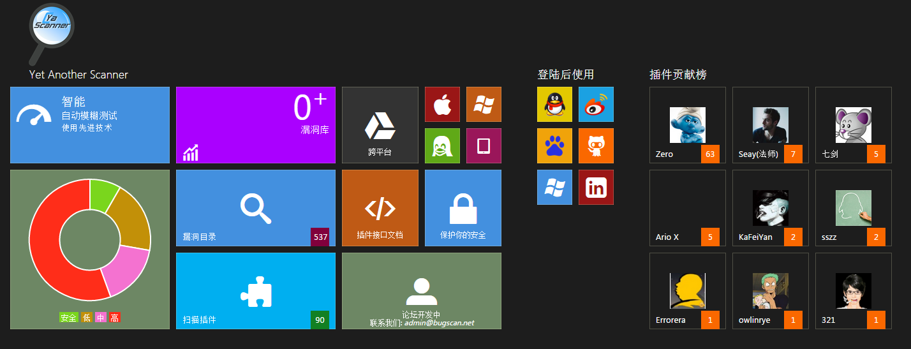
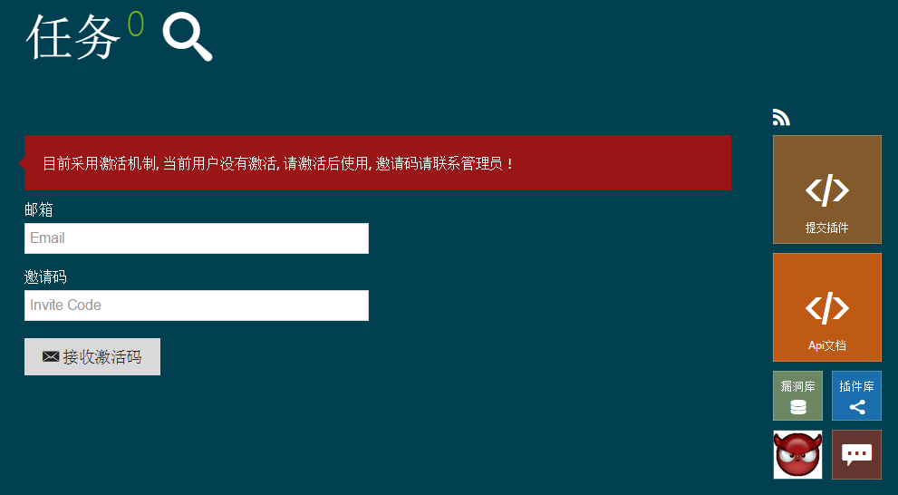

BugScan使用说明
===============

图文说明
------------

扫描器界面
~~~~~~~~~~

第一步：选择任意登陆方式登陆
~~~~~~~~~~~~~~~~~~~~~~~~~~~~

第二步：输入邀请码和邮箱
~~~~~~~~~~~~~~~~~~~~~~~~~~~~

第三步：添加节点
~~~~~~~~~~~~~~~~

1.输入要扫描的域名

2.若没有安装python，请先安装python依赖于Python 2.7.* 

3.执行命令

-  ::

    python -c "exec(__import__('urllib').urlopen('http://bugscan.net/xxxxxxxxxxxxxxx').read())" -m 50

4.根据需要调整选项

5.点击开始扫描按钮

第四步：扫描结束
~~~~~~~~~~~~~~~~

.. image:: _static/jieguo.png

第五步：查看扫描报告
~~~~~~~~~~~~~~~~

.. image:: _static/baogao.png

视频说明
------------

http://pan.baidu.com/s/1jGuwAzG

 

