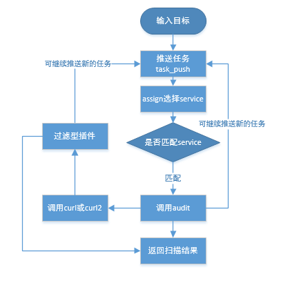

插件编写说明
============

插件接口文档(SDK)
------------------

-  `SDK下载 <https://www.bugscan.net/sdk.zip>`__

插件调用流程
~~~~~~~~~~~~~~~~~~~~~~~~~~~~~~~~~~~~~~

插件两种类型: 审计(主动) and 过滤(被动)

编写样例(Example)
-------------------

-  以下是一个典型的带有详细注释的审计类型的插件，检测robots.txt的敏感信息::

    #!/usr/bin/env python
    # Can import any built-in Python Library
    import urlparse
    import re

    def assign(service, arg):
        '''
        Input Parameter:
            service represents the type of the arg parameter:
                'www'       : arg is a URL such as http://www.abc.com/news.php?id=10
                'www-form'  : arg is a dict structure of a HTML form
                                {
                                    'action': 'http://www.abc.com/login.asp',
                                    'inputs': [
                                            {'type': u'text', 'name': u'login', 'value': 'test'},
                                            {'type': u'password', 'name': u'password', 'value': 'test'},
                                            {'type': u'radio', 'name': u'graphicOption', 'value': u'minimum'}
                                            ],
                                    'ref': 'http://www.abc.com/',
                                    'method': u'post'
                                }

                'ip'        : arg is a IP Address, such as 1.1.1.1
                'dns'       : arg is a Host domain, such as bbs.abc.com

                These parameters are create by the Port_and_Service_Discover built-in plugin
                    service is one of 'ssh', 'ftp', 'mssql', 'mysql', 'telnet', 'vnc'
                    arg is a tuple type like (ipaddr, port)

                These parameters are create by Web_Application_Recognition Plugin
                    service is one of 'discuz', 'phpwind', 'wordpress', 'dedecms', 'php168', 'phpmyadmin', etc ...
                    arg is a URL
        Ret Value:
            First value:
                True:  Accept the dispatch
                False: Reject the dispatch

            Second value:
                the parameter of funtion audit to be received, any type, if type is list, such as [1,2,3]
                The system automatically call function 'audit' three times, such as: audit(true, 1), audit(true, 2), audit(true, 3)

            Third Value: (optional)
                Uniquely identifies of the sub task, prevent sub task repeated
                This parameter is useful in the detection of specific vulnerabilities,
                such as you only want to audit PHP suffix URL just once, do not want all PHP files are detected, you can return like:
                    return True, arg, 'php'
                'php' is the custom uuid of the sub task

        '''

        if service != "www":
            return
        arr = urlparse.urlparse(arg)
        str='%s://%s/robots.txt' % (arr.scheme, arr.netloc)
        #arg为返回的链接, pr为优先级,可以指定唯一uuid
        return True,[{'arg':str,'pr':-1,'uuid':none},] 

    def audit(arg):
        # arg is the second value returned by function 'assign'
        url = arg
        code, head, res, errcode, final_url = curl.curl(url)
        if code == 200:
            if re.search('Content\-Type:\s+[^\n]*text[^\n]+', head, re.M) and res.find('<') == -1:
                sensitive_info = ''
                for m in re.finditer('[^\r\n]+(admin|manage)[^\r\n]+', res, re.M | re.I):
                    sensitive_info += m.group(0)
                sensitive_info = sensitive_info.strip()
                if sensitive_info:
                    security_note(url + ' : ' + sensitive_info)

    # Test code
    if __name__ == '__main__':
        # import local simulation environment
        from dummy import *
        audit(assign('www', 'http://www.discuz.net/')[1])

-  另一个例子来检测discuz CMS的路径::

    #!/usr/bin/env python
    import re
    def assign(service, arg):
        if service == "discuz":
            return True, [{'arg':arg,'pr':-1,'uuid':none},] 

    def audit(arg):
        code, head, res, errcode, _ = curl.curl(arg + 'uc_server/control/admin/db.php')
        if code == 200:
            m = re.search('not found in ([^<]+) on line (\d+)', res)
            if m:
                security_info(m.group(1))

-  以下是一个典型的过滤式插件，在HTML中寻找上传入口::

    #!/usr/bin/env python
    import re

    '''
    Only one function named 'audit', the function is automatically called during the spider crawling
        url     : the URL of current page
        head    : HTTP Response header
        body    : HTTP Body
    '''
    def audit(url, head, body):
        if re.search('<input[^>]+type=[\'"]*file[\'"]*', body, re.I):
            security_note(url)

-  以下是预加载的公共库介绍::

    #!/usr/bin/env python
    '''
    Task scheduling:
        task_push(servie, arg, uuid=None, target=None)  Add a new sub task, such as:
            task_push('www', 'http://www.baidu.com/')
            The scheduler will transfer to all of the audit plugin
            If UUID is not specified, the system will automatically generate a UUID
            If target is specified, the new task of generating report belongs to the domain name value specified for the target

    Function used to report:
        Notify      : security_note(str)
        Information : security_info(str)
        Warning     : security_warning(str)
        High        : security_hole(str)

    The utility function:
        is_ipaddr(str)  check if the string is a IP address
        decode_html(head, body) Decode to utf-8 cross http response header and body
        urljoin(base, ref) such as: urljoin('http://www.baidu.com/', 'abc/../dd.html') returned 'http://www.baidu.com/dd.html'
        html2text(body, head='') HTML to Text
        get_url_host(url) get the host of url
        get_domain_root(url) Get the root domain of a URL (used built-in TLD)
        str_ration(str1, str2) return a float value represent of the similarity of two strings

    curl:
        curl is a pure Python mini version of cURL, only supports the HTTP protocal
        command line format:
        [-I | -d DATA] [-A USER_AGENT] [-b COOKIE]
                        [--connect-timeout CONNECT_TIMEOUT] [-e REFERER]
                        [-H HEADER] [-i] [-m MAX_TIME]
                        [--max-filesize MAX_FILESIZE] [--mime-type MIME_TYPE]
                        [-L] [--max-redirs MAX_REDIRS] [-T] [--retry RETRY]
                        [--retry-delay RETRY_DELAY] [-u USER] [-X REQUEST]
                        <url>
        --mime-type means function will throw a exception if the Content-Type can not find the string specified by --mime-type

        return 5 parameter:
            code:       HTTP Response Code, int type
            head:       HTTP Response header
            body:       HTTP Content
            errcode:    Error code
            final_url:  Redirection of URL, no redirection if same as the visit URL

    Error Code:
        CURLE_OK = 0
        CURLE_COULDNT_CONNECT = 1
        CURLE_OPERATION_TIMEDOUT = 2
        CURLE_RECV_ERROR = 3
        CURLE_SEND_ERROR = 4
        CURLE_FILESIZE_EXCEEDED = 5
        CURLE_COULDNT_RESOLVE_HOST = 6
        CURLE_UNSUPPORTED_PROTOCOL = 7

        CURLE_ARG_ERROR = 8
        CURLE_MIME_ERROR = 9

    Example:
        code, head, body, ecode, redirect_url = curl.curl('-L http://www.baidu.com')
        GET:
            curl.curl('http://www.abc.com/')
        HEAD:
            curl.curl('-H http://www.abc.com/')
        POST:
            curl.curl('-d user=abc&pass=ddd http://www.abc.com/')
        PUT:
            curl.curl('T -d "Content to put" http://www.abc.com/')
        Cookie:
            curl.curl('-b user=abc&pass=ddd http://www.abc.com/')
        Referer:
            curl.curl('-e http://www.google.com/ http://www.abc.com/')
        Flow Redirect:
            curl.curl('-L http://www.abc.com/')

        cURL will automatically accept cookie in the process to obtain the Webpage, second requests will append to request header.
        If you want to empty cookies, use curl.reset()

    '''

    if __name__ == '__main__':
        from dummy import *
        code, head, body, error, _ = curl.curl('http://www.baidu.com/')
        if error == curl.CURLE_OK:
            print "OK"

        print util.is_ipaddr('8.8.8.8')
        print util.decode_html(head, body).decode('utf-8')
        print util.urljoin('http://www.baidu.com/', 'abc/../dd.html')
        print util.html2text(body)
        print util.get_domain_root("www.baidu.com.cn")
        print util.get_domain_root("http://bbs.sina.com.tw")
        print util.str_ratio("good", "not good")
        task_push('www', 'http://www.baidu.com/')

一些必要的解释:
----------------

-  DNS Cache & TCP HOOK:
        built-in DNS cache, supports multi-threading, HOOK socket levels to limit the maximum number of connections
        gethostbyname,  gethostbyname_r The two functions have been replaced with own DNS package, Limit will cancel after call 'reload(socket)'

-  Link fuzzy filter:
        http://www.abc.com/news.asp?id=1

        http://www.abc.com/news.asp?id=2

        http://www.abc.com/news.asp?id=32

        以上这些链接只当成一个url

        http://www.abc.com/20120607.html

        http://www.abc.com/20120608.html

        http://www.abc.com/20120609.html

        http://www.abc.com/20110305.html

        以上这些链接也只当成一个url

